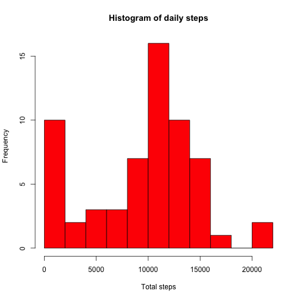
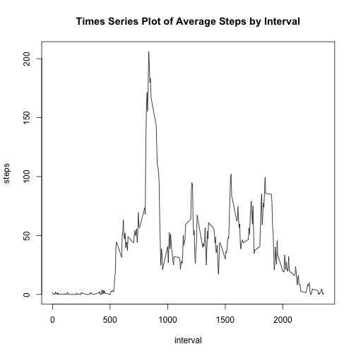
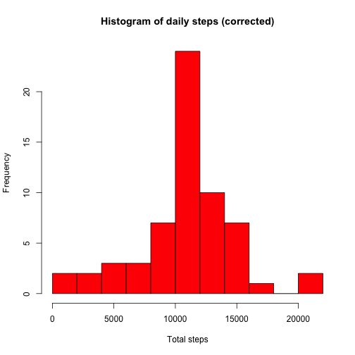
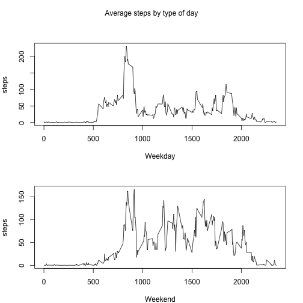

# Reproducible Research: Peer Assessment 1


## Loading and preprocessing the data


```r
# 1. Load the data
unzip('activity.zip')
dataset <- read.csv('activity.csv', header=TRUE, sep = ',', na.strings = NA)
str(dataset)
```

```
## 'data.frame':	17568 obs. of  3 variables:
##  $ steps   : int  NA NA NA NA NA NA NA NA NA NA ...
##  $ date    : Factor w/ 61 levels "2012-10-01","2012-10-02",..: 1 1 1 1 1 1 1 1 1 1 ...
##  $ interval: int  0 5 10 15 20 25 30 35 40 45 ...
```

```r
# 2. Process/transform the data (if necessary) into a format suitable for your analysis
dataset$date <- as.Date(dataset$date, format = "%Y-%m-%d")
str(dataset)
```

```
## 'data.frame':	17568 obs. of  3 variables:
##  $ steps   : int  NA NA NA NA NA NA NA NA NA NA ...
##  $ date    : Date, format: "2012-10-01" "2012-10-01" ...
##  $ interval: int  0 5 10 15 20 25 30 35 40 45 ...
```

## What is mean total number of steps taken per day?


```r
# 3. Calculate the total number of steps taken per day
stepsday <- aggregate(x = dataset$steps , by = list(dataset$date), FUN = sum , na.rm=TRUE)
names(stepsday) <- c("date","steps")

# 4. Make a histogram of the total number of steps taken each day

hist(stepsday$steps, col = "red", xlab = "Total steps", main = "Histogram of daily steps", breaks = 10)
```



```r
# 5. Calculate and report the mean and median of the total number of steps taken per day

mean(stepsday$steps, na.rm = TRUE)
```

```
## [1] 9354.23
```

```r
median(stepsday$steps, na.rm = TRUE)
```

```
## [1] 10395
```

## What is the average daily activity pattern?


```r
# 6. Make a times series plot of the 5-minute interval (x-axis) and the average number of steps taken,
# averaged across all days (y-axis)
avsteps <- aggregate(x = dataset$steps , by = list(dataset$interval), FUN = mean ,na.rm=TRUE)
names(avsteps) <- c("interval","steps")

# Plot
with(avsteps, plot(interval, steps, type = "l", main = "Times Series Plot of Average Steps by Interval"))
```



```r
# 7. Which 5-minute interval, on average across all the days in the dataset, contains the maximum
# number of steps

avsteps[which.max(avsteps$steps),1]
```

```
## [1] 835
```

## Imputing missing values


```r
# 8. Calculate and report the total number of missing values in the dataset

nrow(dataset[is.na(dataset),])
```

```
## [1] 2304
```

```r
# 9. Create a new dataset that is equal to the original dataset but with the missing data filled in.
## Strategy: imputing missing values with average step values at the time interval

imputed <- merge(x = dataset, y = avsteps, by = "interval", all.x = TRUE)
imputed[is.na(imputed$steps.x),c("steps.x")] <- imputed[is.na(imputed$steps.x),c("steps.y")]

# Cleaning and reordering data
imputed <- imputed[,-4]
imputed <- imputed[,c(2,3,1)]
names(imputed)[1] <- "steps"

# 10. Make a histogram of the total number of steps taken each day and Calculate and report the
# mean and median total number of steps taken per day. Do these values differ from the estimates
# from the first part of the assignment? What is the impact of imputing missing data on the
# estimates of the total daily number of steps?

newstepsday <- aggregate(x = imputed$steps , by = list(imputed$date), FUN = sum ,na.rm=TRUE)
names(newstepsday) <- c("date","steps")

# Histogram
hist(newstepsday$steps, col = "red", xlab = "Total steps", main = "Histogram of daily steps (corrected)", breaks = 10)
```



```r
# Mean and Median
mean(newstepsday$steps, na.rm = TRUE)
```

```
## [1] 10766.19
```

```r
## (Previous: [1] 9354.23)

median(newstepsday$steps, na.rm = TRUE)
```

```
## [1] 10766.19
```

```r
## (Previous: [1] 10395)
```


## Are there differences in activity patterns between weekdays and weekends?


```r
# 11. Create a new factor variable in the dataset with two levels – “weekday” and “weekend”
# indicating whether a given date is a weekday or weekend day.

imputed$weekday <- as.factor(ifelse(weekdays(imputed$date) %in% c("Saturday","Sunday"), "Weekend", "Weekday")) 

# 12. Make a panel plot containing a time series plot of the 5-minute interval (x-axis) and the
# average number of steps taken, averaged across all weekday days or weekend days (y-axis). 

avsteps.by.interval.and.weekday  <- aggregate(x = imputed$steps , 
                                                    by = list(imputed$interval,imputed$weekday), FUN = mean ,na.rm=TRUE)
names(avsteps.by.interval.and.weekday) <- c("interval","weekday","steps")

# Plot

weekdays <- subset(avsteps.by.interval.and.weekday,weekday == "Weekday", c(interval,weekday, steps))
weekend <- subset(avsteps.by.interval.and.weekday,weekday == "Weekend", c(interval,weekday, steps))

par(mfrow = c(2, 1), mar = c(4,4,3,2), oma = c(0,0,2,0))
with(weekdays, plot(interval, steps, xlab = "Weekday", type = "l"))
with(weekend, plot(interval, steps, xlab = "Weekend", type = "l"))
mtext("Average steps by type of day", outer = TRUE)
```


